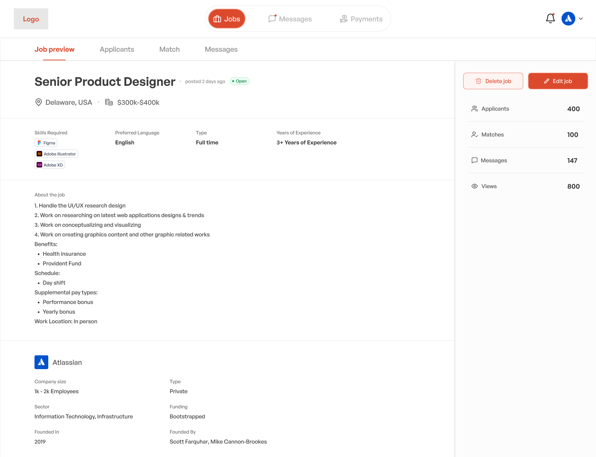
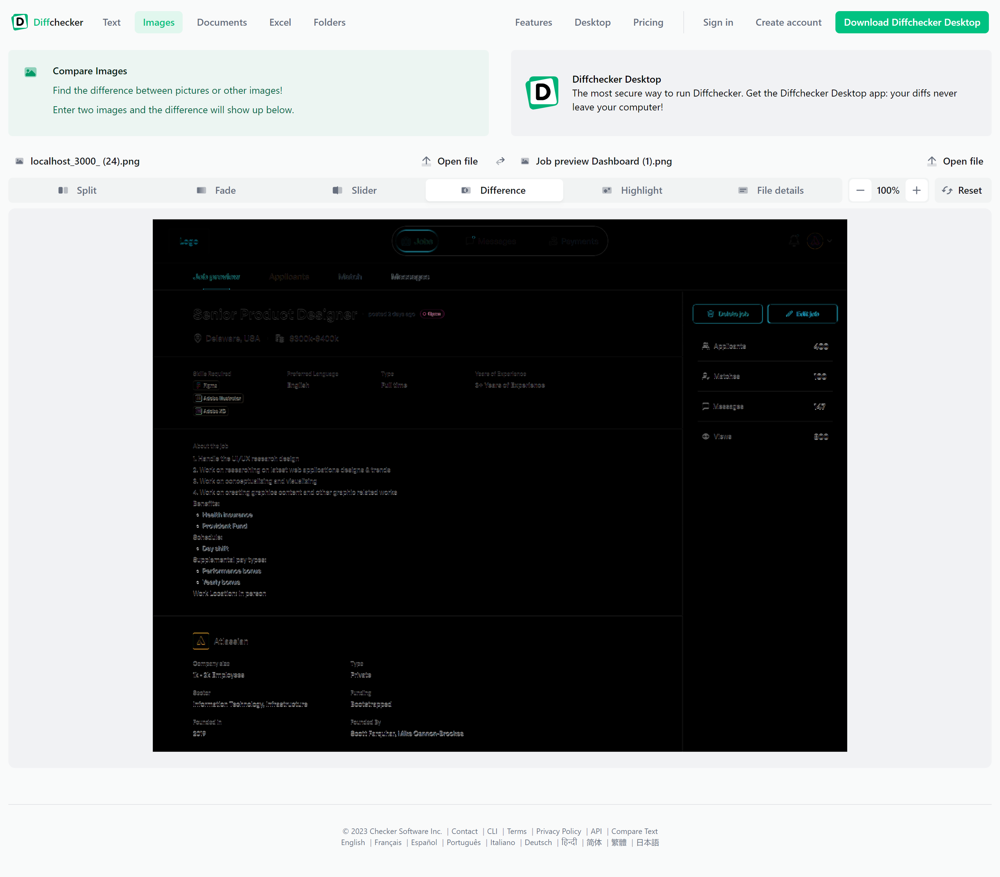

# Project Assessment

This repository contains the code for my CLADE assessment where I converted a Figma design into a responsive, mobile-friendly app using Next.js and Tailwind CSS.

## Features

1. **Figma to App**: Translated the Figma design into a fully functional app using Next.js and Tailwind CSS.
2. **Responsive Design**: The app is fully responsive and mobile-friendly, ensuring a seamless experience across different devices.


## Screenshots

### Original Design Provided



### Developed Design


### Difference Between Original and Developed Design



The difference screenshot was generated using [Diffchecker](https://www.diffchecker.com).

## Technologies Used

- **Next.js**: A React framework for server-side rendering and static site generation.
- **Tailwind CSS**: A utility-first CSS framework for creating custom designs without leaving your HTML.

## Installation and Setup

1. Clone the repository:
    ```bash
    git clone https://github.com/satyam95/clade-assignment.git
    ```
2. Navigate to the project directory:
    ```bash
    cd your-repo-name
    ```
3. Install the dependencies:
    ```bash
    npm install
    ```
4. Run the development server:
    ```bash
    npm run dev
    ```

Open [http://localhost:3000](http://localhost:3000) with your browser to see the result.

## License

This project is licensed under the MIT License. See the [LICENSE](LICENSE) file for more details.
